Kartografické metody v QGIS
===========================
V této kapitole si ukážeme tvorbu několika kartografických metod v QGIS 2.18. Zde použitá data jsou získána z databáze ArcCR500 (možnost stáhnout `zde <https://www.arcdata.cz/produkty/geograficka-data/arccr-500>`_).

Tvorba kartogramů
-----------------
Kartogram je jedna z nejpoužívanějších metod tematické kartografie. Jeho podstatou je znázornění intenzity jevu vyjádřeného relativními hodnotami na sledovaném území. Pracuje s kvantitativními daty. Dělíme je na pravé (vztažené k ploše) a nepravé (nemají prostorový základ), které dále mohou být jednoduché, složené, strukturní, síťové nebo objemové. 
Metoda kartogramu se často kombinuje s metodou kartodiagramu. Výhodou je současné zobrazení absolutních a relativních hodnot. Tvorba `kartodiagramu <http://training.gismentors.eu/qgis-pokrocily/ruzne/grafy.html>`_

1) Jednoduchý pravý kartogram
^^^^^^^^^^^^^^^^^^^^^^^^^^^^^^
Jednoduchým kartogramem může být např. mapa míry nezaměstnanosti v okresech ČR. Do mapového okna přidáme vektorovou vrstvu *OkresyPolygony* z databáze ArcCR500. Postup přidání vektorových dat `zde <http://training.gismentors.eu/qgis-zacatecnik/vektorova_data/vektor_import.html>`_. 
Otevřeme dialogové okno ``Vlastnosti`` vrstvy (pravé tlačítko myši nad vrstvou *OkresyPolygony* a volba Vlastnosti) a v něm záložku ``Styl``. Pro tvorbu kartogramu vybereme možnost ``Odstupňovaný``, která nám umožňuje rozdělit hodnoty do intervalů a vybrat počet tříd.

* Sloupec: zde vybereme sledovaný jev, kterým je v našem případě míra nezaměstnanosti (MIRA_NEZAM). Pomocí |epsilon| můžeme vybírat atributy na základě výrazu.
* Symbol: umožňuje vybrat typ symbolu a měnit barvy, typy výplně, šířku ohraničení atd.
* |precision| umožňuje nastavit počet desetinných míst v legendě, zaškrtnutím Oříznout se odstraní nuly za desetinnou čárkou u hodnot v legendě.
* Barevný rozsah: výběr barev a možnost nastavit vlastní barevný rozsah, zaškrtnutím Invertovat můžeme prohodit pořadí barev.
* Režim: možnost vybrat z 5 možností rozdělení dat – Stejný interval (třídy se stejnou velikostí), Kvantil (stejný počet hodnot v každé třídě), Natural Breaks (rozdělení dat na základě stejných kritérií), Směrodatná odchylka (vypočítá střední hodnotu dat a vytvoří třídy založené na směrodatné odchylce od průměru), Pretty Breaks (hranice tříd jsou celá čísla).
* Histogram: zde můžeme manuálně (posouváním po ose) měnit rozsah tříd.
* Třídy: zvolení počtu tříd/kategorií, do kterých chceme data rozdělit, tlačítky |znamenka| můžeme třídy přidávat nebo mazat.

Pro vytvoření kategorií je třeba zmáčknout tlačítko ``Klasifikovat``.

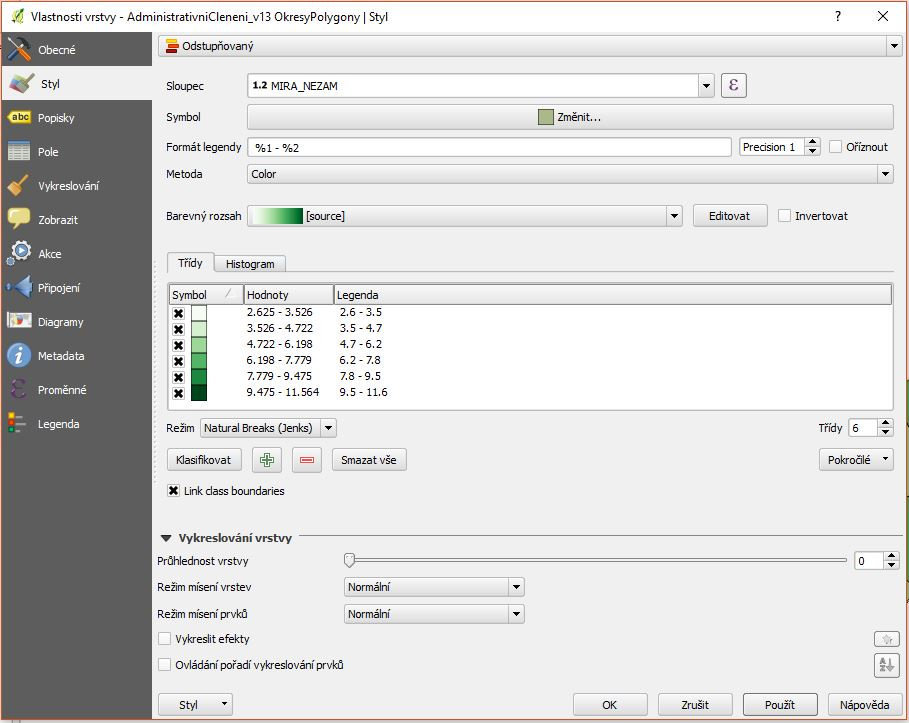

Nakonec vytvoříme pomocí ``Tvůrce mapy`` (Map Composer) výslednou mapu se všemi náležitostmi jako je titul, legenda, měřítko atd. Postup tvorby mapového výstupu `zde <http://training.gismentors.eu/qgis-zacatecnik/mapovy_vystup/index.html>`_.

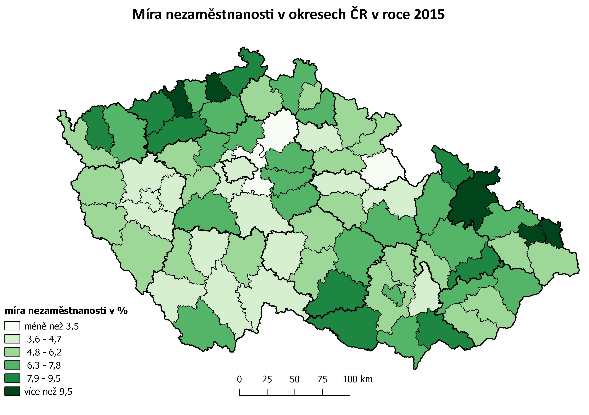

2) Složený kartogram
^^^^^^^^^^^^^^^^^^^^^
Složený kartogram vznikne kombinací dvou jednoduchých kartogramů, může jím být např. mapa podílu zemědělské a lesní půdy na celkové ploše SO ORP kraje Vysočina. Do mapového okna přidáme z databáze ArcCR500 vektorovou vrstvu *ObceSRozsirenouPusobnostiPolygony* a pomocí funkce ``Clip`` (Oříznout) vybereme obce v kraji Vysočina. Informace o druzích pozemků získáme ze `stránek ČSÚ <https://vdb.czso.cz/vdbvo2/faces/cs/index.jsf?page=vystup-objekt&z=T&f=TABULKA&pvo=RSO01&katalog=30829&str=v1339&evo=v727_!_VUZEMI97-100-65hal_1&c=v4~2__RP2016MP12DP31>`_. Z tabulky vybereme pouze ORP v kraji Vysočina, zemědělskou půdu a lesní pozemek a tuto novou tabulku připojíme k ořízlé vrstvě ORP (`návod zde <http://training.gismentors.eu/qgis-zacatecnik/vektorova_data/join.html>`_). Tuto doplněnou vrstvu musíme mít v mapovém okně dvakrát. Jako spodní vrstvu zvolíme zemědělské pozemky a jako horní vrstvu lesní pozemky.
Další postup je obdobný jako u tvorby jednoduchého kartogramu v předešlé kapitole. Postupně klasifikujeme data z obou vrstev do intervalů a následně spodní vrstvu upravíme do podoby barevného kartogramu a horní vrstvu do podoby rastrového kartogramu. Tvorba rastrového kartogramu je složitější než u barevného, jelikož QGIS neumí automaticky generovat rastrové stupnice a tudíž musíme znaky pro všechny intervaly definovat manuálně.
V záložce ``Symbol`` vybereme Typ vrstvy symbolů → Výplň liniovým vzorkem a v tabulce ``Třídy`` postupně měníme symboly intervalů.

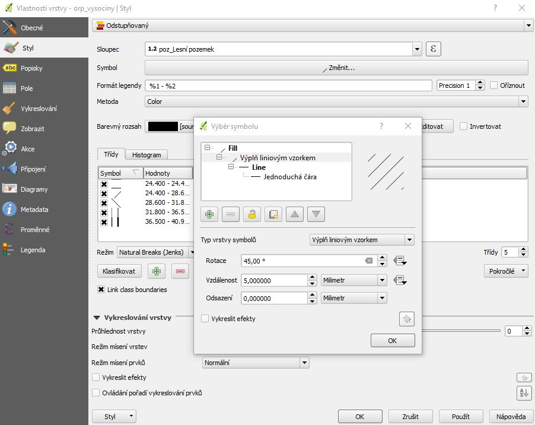

Mapu se všemi náležitostmi dokončíme opět pomocí ``Tvůrce mapy`` (Map composer).

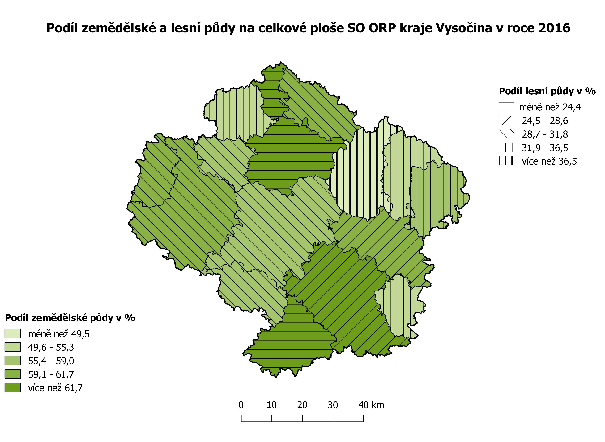

3) Objemový (prostorový) kartogram
^^^^^^^^^^^^^^^^^^^^^^^^^^^^^^^^^^^
Objemový kartogram je specifické vyjádření jednoduchého kartogramu. Jednotlivé areály jsou vždy vyvýšeny o příslušnou kvantitu jevu. Pro tvorbu tohoto kartogramu použijeme stejná data jako u jednoduchého kartogramu – *OkresyPolygony*. Data nahrajeme do mapového okna, otevřeme ``Vlastnosti`` vrstvy a záložku ``Styl``. Zde vybereme možnost ``2.5 D``, která umožňuje nastavit 2.5 D efekty pomocí několika základních parametrů.

* Výška: lze nastavit buď pomocí pevné hodnoty (v mapových jednotkách), výběrem jedno z polí vrstvy nebo výrazem.
* Úhel: nastavení úhlu pohledu (ve stupních), 0° znamená západ - roste ve směru hodinových ručiček.
* Roof color, Wall color: nastavení barev střechy a stěny, pro simulaci slunečního záření zaškrtnout políčko Shade walls based on aspekt.
* Stín: nastavení barvy a velikosti stínu (v mapových jednotkách).

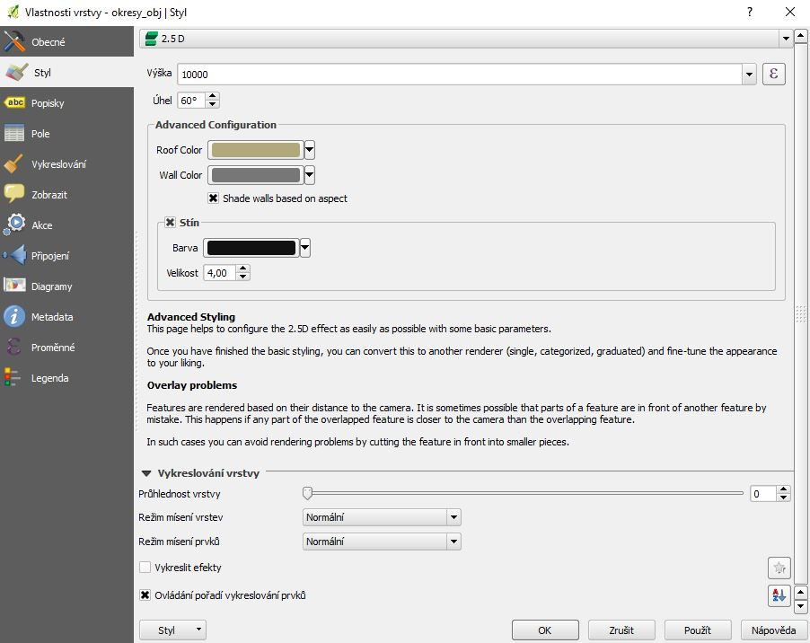

Po dokončení nastavení efektů v 2.5 D zvolíme možnost ``Odstupňovaný`` a rozdělíme hodnoty do intervalů podobně jako při tvorbě jednoduchého kartogramu. Nakonec vytvoříme mapu se všemi náležitostmi ve ``Tvůrci map``.

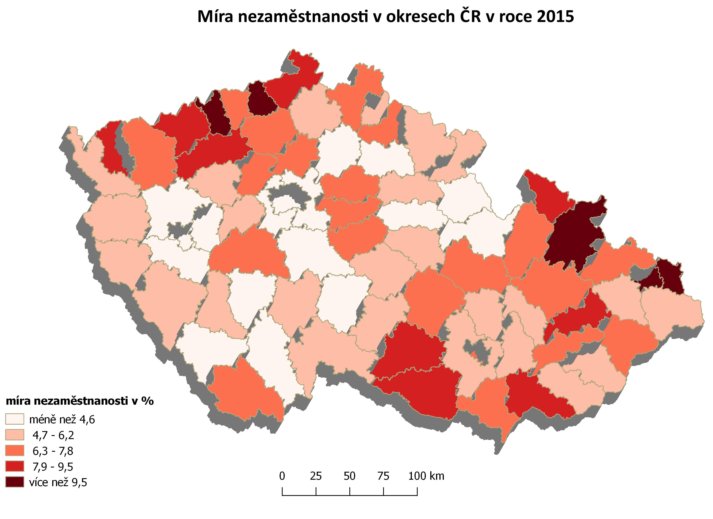

Dasymetrická metoda
-------------------
Dasymetrická metoda se používá pro znázorňování oblastí se stejnou intenzitou jevu, např. mapa hustoty obyvatel. Do mapového okna přidáme z databáze ArcCR500 vektorovou vrstvu *ZakladniSidelniJednotkyPolygony* a v atributové tabulce vybereme pouze obce v kraji Vysočina a vytvoříme novou vrstvu Shapefile.
Nejprve spočítáme velikost hustoty zalidnění. Otevřeme atributovou tabulku a zmáčkneme |editace| *Přepnout režim editace*. Poté přidáme nový sloupec pomocí tlačítka |sloupec| *New field*, kde zadáme název Hustota a typ zvolíme desetinné číslo. Otevřeme kalkulátor polí |kalkul|, kde zaškrtneme *Aktualizovat existující pole*, vybereme pole Hustota a napíšeme výraz pro výpočet hustoty (POCET_OB_1/SHAPE_Area)* '1000000'. Další postup je obdobný jako u tvorby jednoduchého kartogramu, s tím rozdílem, že třídy rozdělíme manuálně pomocí ``Histogramu`` a plochy nebudou obsahovat hranice. Výslednou mapu se všemi náležitostmi vytvoříme ve ``Tvůrci map``.

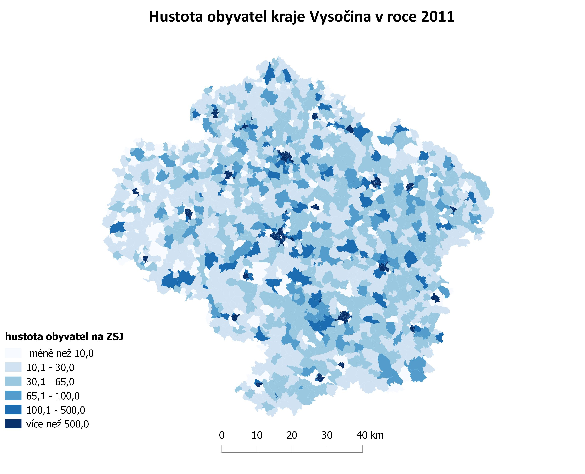

Metoda teček
------------
V kartografii rozlišujeme dvě metody teček dle typu znázorňovaného jevu - kvalitativní a kvantitativní. U kvalitativního jevu se metoda teček využívá ke znázornění lokalizace jevu v mapě (ne vždy se jedná o zobrazení pomocí tečky, může se jednat i o jiný geometrický tvar). U kvantitativního jevu se jedná o znázornění nerovnoměrně rozmístěných nespojitých jevů v mapě (jedna tečka = jeden jev). Rozlišujeme dva typy rozmístění teček – topografický a kartogramový.

1) Topografický způsob
^^^^^^^^^^^^^^^^^^^^^^
Tímto způsobem můžeme vyjádřit rozmístění jevu v mapě podle rozmístění jevů v terénu. Tento způsob vyžaduje, aby rozmístění jevu v mapě bylo podobné skutečnosti, shodnost ovšem nejde zajistit. Nejčastějším příkladem jsou mapy počtu obyvatel. Pro tvorbu této mapy použijeme data z databáze ArcCR500, jako vektorovou vrstvu použijeme *ZakladniSidelniJednotkyBody* a v atributové tabulce vybereme pouze obce v kraji Vysočina a vytvoříme novou vrstvu Shapefile. Otevřeme ``Vlastnosti`` vrstvy a záložku ``Styl``. Zde vybereme možnost ``Odstupňovaný``, jako Sloupec zvolíme POCET_OBYV_1 a jako Symbol Marker – Jednoduchá značka. Následně určíme počet tříd, vhodně je rozdělíme a pro každou třídu nastavíme jinou velikost značky. Mapu se všemi náležitostmi vytvoříme ve ``Tvůrci map``.

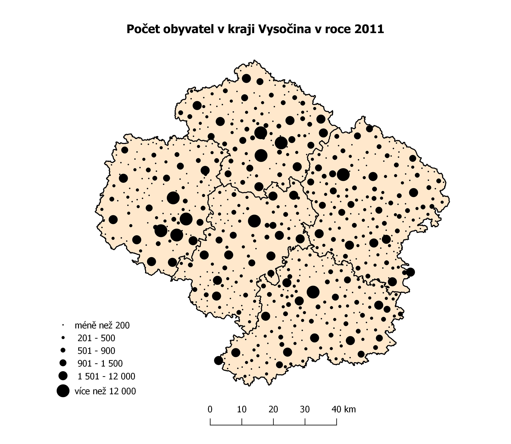

2) Kartogramový způsob
^^^^^^^^^^^^^^^^^^^^^^
Tento způsob je založen na rovnoměrném rozmístění teček v určité, předem stanovené územní jednotce. Lze jím např. zobrazit hustotu obyvatel na jeden kilometr čtvereční. Pro tvorbu této mapy použijeme stejná data jako při tvorbě dasymetrické metody. Následně otevřeme ``Vlastnosti`` vrstvy a záložku ``Styl``. Zde vybereme možnost ``Odstupňovaný``, jako Sloupec zvolíme Hustota a v záložce Symbol vybereme Fill dotted - tato funkce nám umožňuje rovnoměrně rozdělit body v ploše. Zde zvolíme Výplň bodovým vzorkem, nastavíme vodorovnou a svislou vzdálenost 10 milimetrů a vodorovný a svislý posun 0 a dále můžeme ještě vybrat barvu tečky a výplně. Následně určíme počet tříd, vhodně je rozdělíme a pro každou třídu nastavíme jinou velikost tečky. Mapu se všemi náležitostmi vytvoříme ve ``Tvůrci map``.

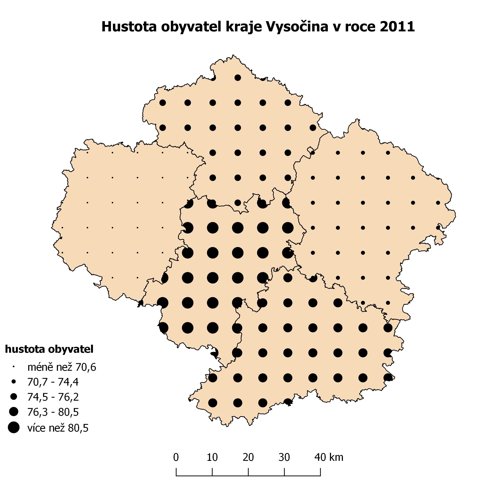

Zobrazení popisků
-----------------
V QGISu existuje několik možností vložení popisků k hodnotám v mapovém okně. Jednotlivé možnosti si ukážeme na vrstvě *KrajePolygony* z databáze ArcCR500.

1) Anotace
^^^^^^^^^^^
Pokud chceme ručně přidat popisek, je vhodné použít anotace, které se ukládají do mapového projektu. Najdeme je pod tlačítkem |anotace|, kde si dále můžeme vybrat z několika možností anotací. Vybereme Textovou anotaci a klikneme na místo, kam jí chceme umístit. Do vytvořeného obdélníku napíšeme zvolený text a navolíme typ, velikost, barvu písma, barvu pozadí a rámu anotace. S vytvořenou anotací můžeme různě pohybovat či měnit velikost obdélníku nebo ohraničující obdélník úplně odstranit.

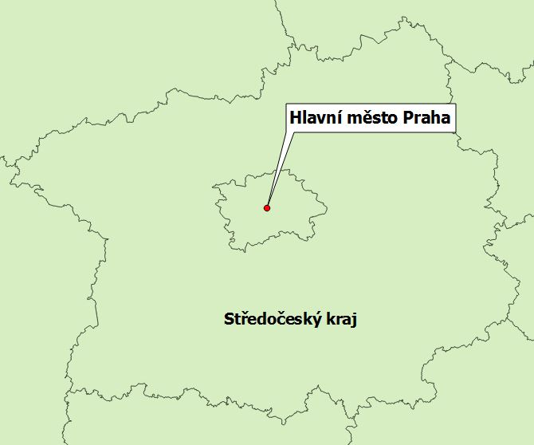

2) Popisky z datových vrstev
^^^^^^^^^^^^^^^^^^^^^^^^^^^^^
Pokud chceme vygenerovat popisky automaticky k vybranému atributu, provedeme to ve ``Vlastnostech`` vrstvy a v záložce ``Popisky``. Zde vybereme ``Zobrazit popisky pro tuto vrstvu`` a vybereme zdroj popisku. Dále máme několik možností úpravy textu.

* Text: výběr typu, stylu, velikosti a barvy písma.
* Formátování: nastavení výšky řádku, možnost zalomit text na určitém znaku, zarovnání či formátování čísla.
* Obalová zóna: vykreslení obalové zóny kolem písma, její barvy, velikosti.
* Pozadí: výběr tvaru, velikosti, barvy, šířky pozadí.
* Stín: možnost vybrat pod čím chceme stín vykreslit, jeho odsazení, poloměr rozostření, barvu, měřítko.
* Umístění: umožňuje umístit text vodorovně, volně, okolo centroidu atd. nebo ho lze definovat daty.
* Vykreslování: výběr viditelnosti závislé na měřítku nebo velikosti pixelu, definování daty, zobrazení popisků vzhůru nohama, omezení počtu prvků, odradit popisky od překrytí prvků.

Pokud bychom chtěli s vygenerovanými popisky různě pohybovat, je třeba udělat následující kroky. V atributové tabulce si vytvoříme tři nové sloupce, do kterých se budou ukládat souřadnice umístění a rotace popisku (popx, popy, popr), datový typ bude desetinné číslo. Otevřeme ``Vlastnosti`` vrstvy, záložku ``Popisky`` a možnost ``Umístění``, zde vybereme možnost ``Definovaný daty`` a vybereme vytvořené sloupce.

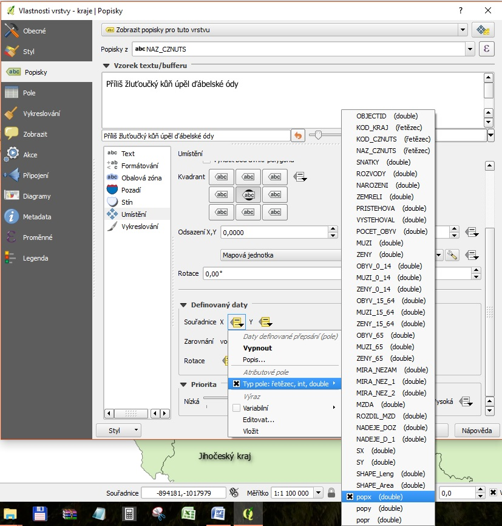

Zapneme editaci vrstvy |editace|. Pokud nemáme zapnutou nástrojovou lištu ``Panel nástrojů popisek``, tak jí v záložce ``Zobrazit`` zapneme. Objeví se nám několik ikon pro práci s popisky |ikony|, kde pro posun popisku slouží čtvrtá ikona a pro rotaci pátá ikona. Po změně umístění popisku se nám jeho souřadnice a rotace zapíší do sloupců popx, popy a popr v atributové tabulce. Nakonec je třeba vše uložit.

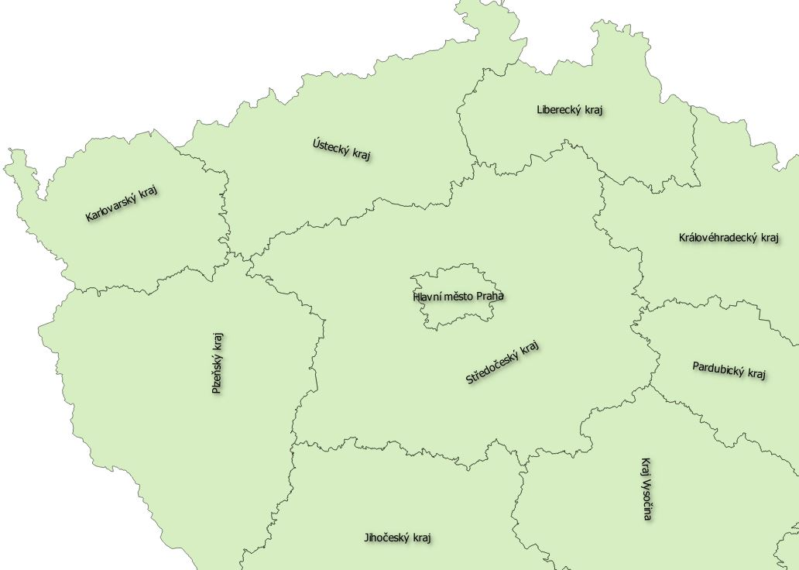

3) Tvůrce map
^^^^^^^^^^^^^
Popisky lze přidávat také v ``Tvůrci map`` (Map Composer) pomocí tlačítka |tvurce| Přidat popisek, které nalezneme buď v postraní liště nebo v záložce ``Rozvržení``. Po vytvoření popisku kliknutím do mapového okna můžeme měnit jeho umístění, velikost, písmo, barvu, okraje, zarovnání, rotaci, rám či pozadí.

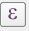
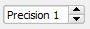

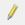
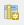
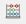
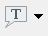
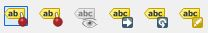
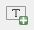